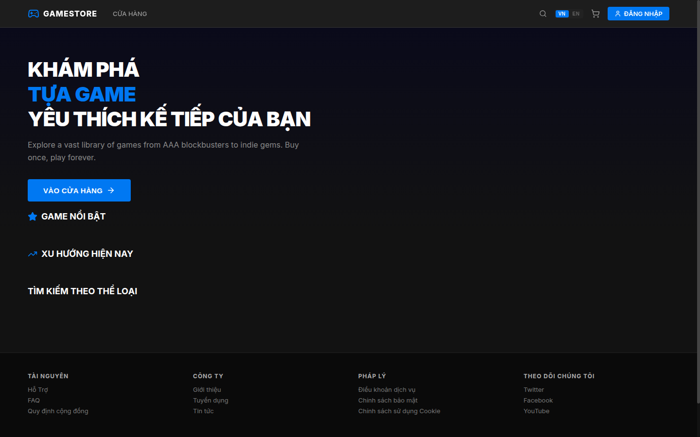
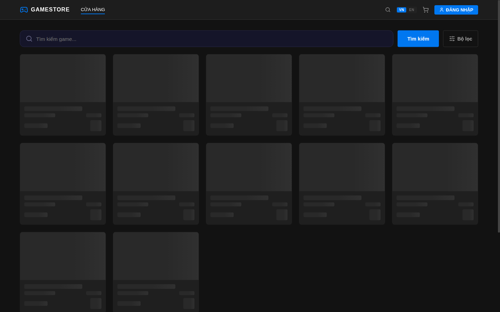
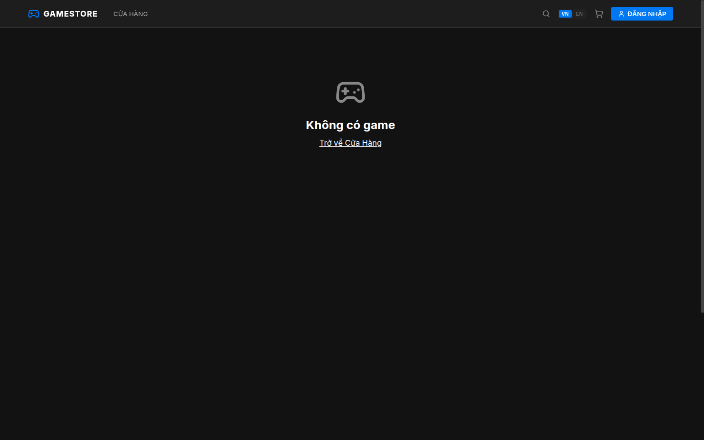
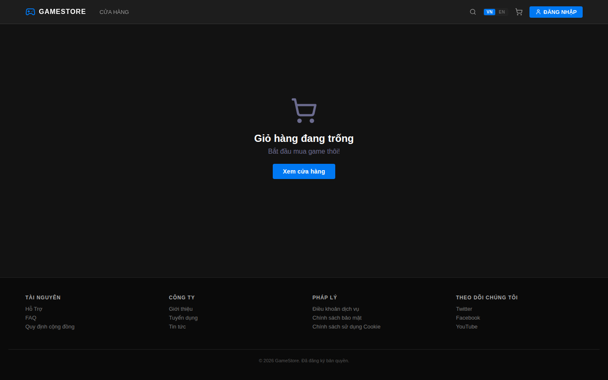
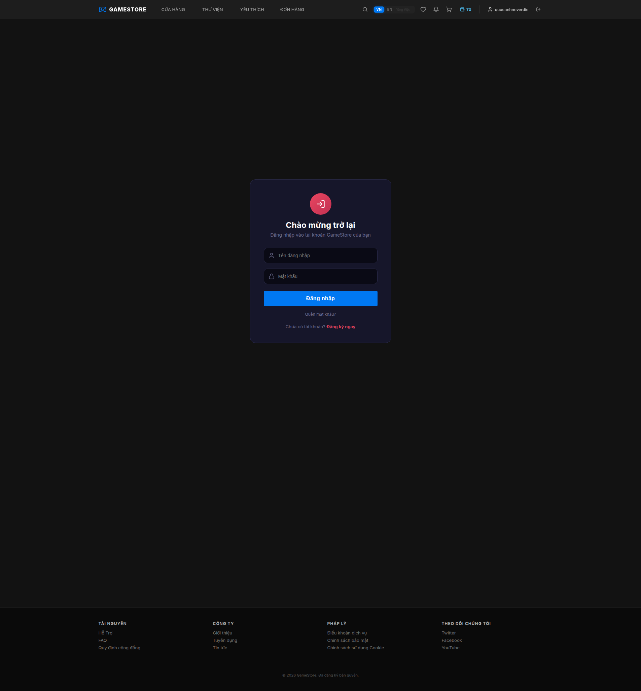
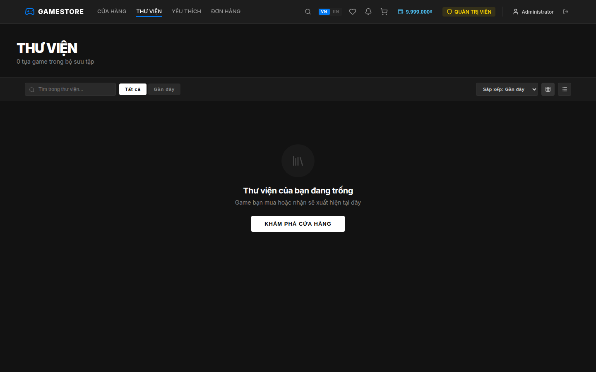
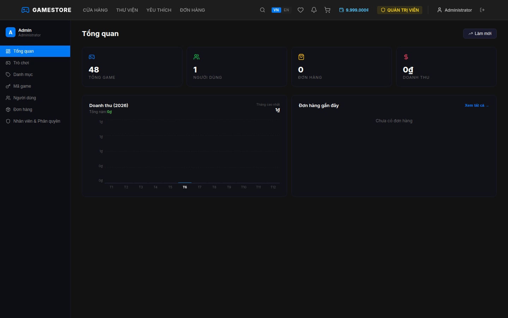

<!-- README.md -->
# 🎮 GameStore - Fullstack Game Distribution Platform

> A full-stack game store inspired by **Epic Games** and **Steam**, built with **.NET 10** + **React 19** + **SQL Server** + **Microservices architecture**.


---

## 📖 TABLE OF CONTENTS

- [About The Project](#-about-the-project)
- [Tech Stack](#-tech-stack)
- [Project Structure](#-project-structure)
- [Database Schema](#-database-schema)
- [Features](#-features)
- [Getting Started](#-getting-started)
- [How to Run](#-how-to-run)
- [Scripts](#-scripts)
- [Default Accounts](#-default-accounts)
- [API Documentation](#-api-documentation)
- [i18n / Quốc tế hóa](#-i18n--quốc-tế-hóa)
- [Screenshots](#-screenshots)
- [Troubleshooting](#-troubleshooting)
- [Future Enhancements](#-future-enhancements)
- [Contributing](#-contributing)
- [Author](#-author)
- [License](#-license)

---

## 🎯 ABOUT THE PROJECT

GameStore is a **full-stack web application** simulating a digital game distribution platform. Users can browse, search, filter, purchase games, manage their library, write reviews, and track orders. Admins have a comprehensive dashboard to manage games, users, orders, categories, **game keys**, **payments/refunds**, and **staff roles & permissions**.

### ✨ Key Highlights

- **Microservices architecture** with API Gateway (Ocelot)
- **JWT Authentication** with role-based authorization (Admin / User / Publisher)
- **Repository Pattern + Service Layer** for clean separation of concerns
- **Entity Framework Core** with SQL Server and seed data
- **Full admin panel** — dashboard, CRUD games/users/orders, game keys, payments, roles, staff
- **i18n** — Hỗ trợ Tiếng Việt & English
- **Responsive dark UI** inspired by Epic Games Store
- **48 games** pre-loaded for pagination testing

### 🏫 University Course Project

Built to demonstrate:

- Full-stack development with .NET + React
- Repository Pattern + Service Layer architecture
- JWT Authentication & Role-based Authorization
- Entity Framework Core with SQL Server
- State management with Zustand
- Microservices with API Gateway (Ocelot)
- Responsive UI design
- Internationalization (i18n)

---

## 🛠️ TECH STACK

### Backend

| Technology | Version | Purpose |
|------------|---------|---------|
| [.NET](https://dotnet.microsoft.com/) | 10.0 | Web API Framework |
| [Entity Framework Core](https://learn.microsoft.com/en-us/ef/) | 10.0.7 | ORM |
| [SQL Server](https://www.microsoft.com/sql-server) | 2022 | Database |
| [JWT](https://jwt.io/) | — | Authentication |
| [Ocelot](https://github.com/ThreeMammals/Ocelot) | 24.1.0 | API Gateway |
| [Swashbuckle](https://github.com/domaindrivendev/Swashbuckle) | 10.1.7 | API Documentation (Swagger) |
| [JwtBearer](https://learn.microsoft.com/en-us/aspnet/core/security/authentication) | 10.0.7 | JWT Authentication Handler |

### Frontend

| Technology | Version | Purpose |
|------------|---------|---------|
| [React](https://react.dev/) | 19.2.5 | UI Library |
| [Vite](https://vitejs.dev/) | 8.0.10 | Build Tool |
| [React Router](https://reactrouter.com/) | 7.14.2 | Routing |
| [Zustand](https://zustand-demo.pmnd.rs/) | 5.0.12 | State Management |
| [Axios](https://axios-http.com/) | 1.15.2 | HTTP Client |
| [i18next](https://www.i18next.com/) | 26.3.1 | Internationalization |
| [Framer Motion](https://www.framer.com/motion/) | 12.38.0 | Animations |
| [Lucide React](https://lucide.dev/) | 1.11.0 | Icons |
| [React Hot Toast](https://react-hot-toast.com/) | 2.6.0 | Notifications |
| [Swiper](https://swiperjs.com/) | 12.1.4 | Slider/Carousel |
| [React Hook Form](https://react-hook-form.com/) | 7.73.1 | Form management |
| [Day.js](https://day.js.org/) | 1.11.20 | Date formatting |
| [MUI](https://mui.com/) | 9.0.0 | UI components (limited use) |

### Design

- **Inspiration**: Epic Games Store
- **Theme**: Dark (#121212) + Blue accent (#0078f2)
- **Font**: Inter (Google Fonts)
- **Styling**: CSS Variables + Inline Styles

---

## 📂 PROJECT STRUCTURE

```
GameStore/
│
├── GameStore.Entities/            # Entity Classes
│   ├── Audit/IAuditable.cs
│   ├── Auth/
│   │   ├── AccessToken.cs
│   │   ├── Role.cs
│   │   └── PasswordResetToken.cs
│   ├── Games/
│   │   ├── Game.cs
│   │   ├── Genre.cs
│   │   └── GameGenre.cs
│   ├── Store/
│   │   ├── Order.cs, OrderDetail.cs, Payment.cs
│   │   ├── Library.cs, Wishlist.cs, Review.cs
│   │   ├── GameKey.cs, Notification.cs
│   │   └── RolePermission.cs
│   ├── Users/
│   │   ├── User.cs
│   │   └── UserRole.cs
│   └── Settings/Setting.cs
│
├── GameStore.Common/              # Shared Utilities
│   ├── Entity.cs                  # Base class (IAuditable)
│   ├── Auth/TokenHelper.cs        # JWT + Password hashing
│   └── GameStore.Common.csproj
│
├── GameStore.DTOs/                # Data Transfer Objects (26 files)
│   ├── Auth/
│   │   ├── LoginRequest.cs, RegisterRequest.cs
│   │   ├── ForgotPasswordRequest.cs, ResetPasswordRequest.cs
│   ├── Games/GameCreateDto.cs, GameUpdateDto.cs
│   ├── Orders/CreateOrderDto.cs, OrderHistoryDto.cs, UpdateStatusDto.cs
│   ├── Reviews/CreateReviewDto.cs, ReviewDto.cs
│   ├── Notifications/NotificationDto.cs
│   ├── Users/TopUpRequest.cs, UpdateUserRequest.cs
│   ├── Genres/GenreDto.cs
│   ├── Wishlist/WishlistItemDto.cs
│   ├── Common/
│   │   ├── PaginationHelper.cs
│   │   └── PagedResponse.cs
│   └── Admin/
│       ├── AdminGameCreateDto.cs, AdminGameUpdateDto.cs
│       ├── AdminUserUpdateDto.cs, AdminUpdateStatusDto.cs
│       ├── CategoryDto.cs, GameKeyDto.cs, RefundDto.cs, RoleDto.cs
│       ├── AssignRoleDto.cs, BatchGameKeyDto.cs
│       └── UpdateGameKeyDto.cs
│
├── GameStore.Repository/          # Data Access Layer
│   ├── EFCore/
│   │   ├── IRepository.cs         # Generic interface
│   │   ├── Repository.cs          # Generic implementation
│   │   ├── IGameRepository.cs / GameRepository.cs
│   │   ├── IUserRepository.cs / UserRepository.cs
│   │   ├── IGenreRepository.cs / GenreRepository.cs
│   │   └── IOrderRepository.cs / OrderRepository.cs
│   ├── GameStoreDbContext.cs      # EF Core DbContext + Seed Data
│   ├── GameStoreDbContextFactory.cs
│   └── Migrations/                # EF Core Migrations
│       ├── 20260510132755_InitialUnified.cs
│       └── 20260604155259_AddPaginationSeedData.cs
│
├── GameStore.Services/            # Business Logic Layer
│   ├── Authen/
│   │   ├── IUserService.cs
│   │   └── UserService.cs
│   ├── IGameService.cs / GameService.cs
│   ├── IGenreService.cs / GenreService.cs
│   ├── IOrderService.cs / OrderService.cs
│   ├── ILibraryService.cs / LibraryService.cs
│   ├── IWishlistService.cs / WishlistService.cs
│   ├── IReviewService.cs / ReviewService.cs
│   ├── INotificationService.cs / NotificationService.cs
│   └── IAdminService.cs / AdminService.cs
│
├── GameStore.AuthService/         # Authentication Microservice (:5002)
│   ├── Controllers/
│   │   ├── AuthController.cs      # Login, Register, Forgot/Reset Password
│   │   └── UserController.cs      # Profile, Wallet Top-up
│   ├── Program.cs
│   └── appsettings.json
│
├── GameStore.APIService/          # Business API Microservice (:5001)
│   ├── Controllers/
│   │   ├── GamesController.cs     # Browse, search, featured, detail
│   │   ├── GenresController.cs    # List genres
│   │   ├── OrdersController.cs    # Create, history, cancel
│   │   ├── LibraryController.cs   # User library
│   │   ├── WishlistController.cs  # Wishlist CRUD
│   │   ├── ReviewsController.cs   # Review CRUD
│   │   ├── NotificationsController.cs
│   │   └── AdminController.cs     # Full admin CRUD
│   ├── Program.cs
│   └── appsettings.json
│
├── GameStore.ApiGateway/          # API Gateway (:5000)
│   ├── ocelot.json                # Route configuration
│   ├── Program.cs
│   └── appsettings.json
│
├── GameStore.WebClient/           # React Frontend (:3000)
│   ├── src/
│   │   ├── main.jsx               # Entry point
│   │   ├── App.jsx                # Router config (15 routes)
│   │   ├── contexts/
│   │   │   └── AuthContext.jsx     # Auth state provider
│   │   ├── stores/
│   │   │   └── cartStore.js       # Zustand cart store
│   │   ├── services/
│   │   │   └── api.js             # Axios API client (all endpoints)
│   │   ├── i18n/
│   │   │   ├── i18n.js            # i18next config
│   │   │   └── locales/
│   │   │       ├── vi.json        # Vietnamese translations
│   │   │       └── en.json        # English translations
│   │   ├── styles/
│   │   │   └── global.css         # Global styles + CSS variables
│   │   ├── components/
│   │   │   ├── layout/
│   │   │   │   ├── Navbar.jsx     # Nav with search, cart, wallet, notifications
│   │   │   │   ├── Footer.jsx
│   │   │   │   └── MainLayout.jsx # Page transitions
│   │   │   ├── games/
│   │   │   │   ├── GameCard.jsx
│   │   │   │   └── FeaturedSlider.jsx
│   │   │   ├── wallet/
│   │   │   │   └── WalletModal.jsx
│   │   │   ├── common/
│   │   │   │   └── ErrorBoundary.jsx
│   │   │   └── admin/
│   │   │       ├── AdminSidebar.jsx
│   │   │       ├── DashboardTab.jsx
│   │   │       ├── GamesTab.jsx / GameFormModal.jsx
│   │   │       ├── UsersTab.jsx / UserFormModal.jsx / DeleteUserModal.jsx
│   │   │       ├── OrdersTab.jsx / PaymentsTab.jsx
│   │   │       ├── CategoriesTab.jsx
│   │   │       ├── GameKeysTab.jsx
│   │   │       ├── StaffRolesTab.jsx
│   │   │       ├── SortableHeader.jsx
│   │   │       ├── Pagination.jsx
│   │   │       ├── DeleteConfirmModal.jsx
│   │   │       └── adminStyles.js
│   │   └── pages/
│   │       ├── HomePage.jsx       # Hero, featured, genres
│   │       ├── StorePage.jsx      # Browse + filter + paginate
│   │       ├── GameDetailPage.jsx # Detail + reviews + system req
│   │       ├── CartPage.jsx
│   │       ├── PaymentPage.jsx
│   │       ├── InvoicePage.jsx
│   │       ├── LibraryPage.jsx
│   │       ├── WishlistPage.jsx
│   │       ├── PurchaseHistoryPage.jsx
│   │       ├── LoginPage.jsx
│   │       ├── RegisterPage.jsx
│   │       ├── ForgotPasswordPage.jsx
│   │       ├── ResetPasswordPage.jsx
│   │       ├── ProfilePage.jsx
│   │       └── AdminPage.jsx
│   ├── vite.config.js
│   └── package.json
│
├── run-all.sh                     # Start all services (--rebuild, --clean flags)
├── kill-all.sh                    # Stop all services (--force, --clean flags)
├── GameStore.sln / GameStore.slnx # Solution files
└── README.md                      # This file
```

---

## 🗄️ DATABASE SCHEMA

```
Users ──┬── UserRoles ── Roles
         ├── Orders ── OrderDetails ── Games
         ├── Library ──────────────── Games
         ├── Wishlist ─────────────── Games
         ├── Reviews ──────────────── Games
         ├── AccessTokens
         ├── Notifications
         └── PasswordResetTokens

Games ──┬── GameGenres ── Genres
         ├── GameKeys ─── OrderDetails
         ├── OrderDetails
         ├── Library
         ├── Wishlist
         └── Reviews

Roles ─── RolePermissions

Orders ── Payments
```

### Key Relationships

| Entity | Relations |
|--------|-----------|
| **User** | Has many Orders, Libraries, Wishlists, Reviews, Notifications, AccessTokens, UserRoles |
| **Game** | Has many GameGenres, GameKeys, OrderDetails, Reviews, Wishlists |
| **Order** | Has many OrderDetails, Payments; belongs to User |
| **Role** | Has many UserRoles, RolePermissions |
| **GameKey** | Belongs to Game; optional OrderDetail (when sold) |

### Seed Data

| Table | Rows |
|-------|------|
| Roles | 3 (Admin, User, Publisher) |
| Users | 1 (admin) |
| UserRoles | 1 (admin → Admin) |
| Genres | 35 |
| Games | **48** (12 original + 36 pagination test) |
| GameGenres | 167+ |

---

## ✨ FEATURES

### 👤 User Features
- **Browse & Search** — Filter by genre, price range (₫), sort by sales/rating/price/name
- **Game Detail** — Description, screenshots, system requirements, reviews
- **Shopping Cart** — Add/remove games, quantity management
- **Checkout** — Pay with GameStore wallet (₫)
- **Library** — View owned games
- **Wishlist** — Save games for later
- **Reviews** — Rate (1-5⭐) and review games
- **Order History** — Track order status (Pending → Completed / Cancelled / Refunded)
- **Invoice** — View/download invoice with order timeline
- **Profile** — Update display name, email, phone, avatar, change password
- **Wallet** — Top-up balance with preset amounts (₫)
- **Notifications** — Real-time bell icon with unread badges (30s polling)

### 🔐 Authentication
- **Register** — Username, password, display name, email, phone
- **Login** — JWT token-based
- **Forgot/Reset Password** — Token-based password reset
- **Role-based UI** — Regular users vs Admin views

### 🔧 Admin Dashboard

| Tab | Features |
|-----|----------|
| **Dashboard** | Stats (games, users, orders, revenue), monthly revenue chart, recent orders |
| **Games** | CRUD with genres, auto-generate 10-20 game keys on create |
| **Users** | View, edit wallet/status, delete users |
| **Orders** | View all orders, approve (sends keys + notification), cancel (refunds wallet) |
| **Categories (Genres)** | CRUD with game count |
| **Game Keys** | View keys by game/status, add single/batch, edit expiry, delete |
| **Payments** | View all payments, refund with note |
| **Staff & Roles** | Manage roles with granular permissions, assign/revoke roles to users |

### 🌐 i18n
- Full Vietnamese (`vi`) and English (`en`) support
- ~350 translation keys per language (~700 total)
- Language persisted in localStorage

---

## 🚀 GETTING STARTED

### Prerequisites

| Software | Version | Download |
|----------|---------|----------|
| .NET SDK | 10.0+ | [dotnet.microsoft.com](https://dotnet.microsoft.com/download/dotnet/10.0) |
| Node.js | 20+ | [nodejs.org](https://nodejs.org/) |
| SQL Server | 2022 | [microsoft.com/sql-server](https://www.microsoft.com/sql-server) |
| SSMS (optional) | 20+ | [docs.microsoft.com/ssms](https://docs.microsoft.com/en-us/sql/ssms) |

### Installation

**1. Clone the repository**

```bash
git clone https://github.com/yourusername/GameStore.git
cd GameStore
```

**2. Configure Database Connection**

Edit `GameStore.AuthService/appsettings.json`:
```json
{
  "ConnectionStrings": {
    "DefaultConnection": "Server=127.0.0.1,1434;Database=GameStoreDB_Full;User Id=sa;Password=YOUR_PASSWORD;Encrypt=True;TrustServerCertificate=True;MultipleActiveResultSets=True;"
  },
  "Jwt": {
    "SecretKey": "GameStoreSecretKeyForAuthenticationShouldBeLongEnough123456!@#$%^",
    "ExpireMinutes": 480,
    "Issuer": "AuthService",
    "Audience": "APIService"
  }
}
```

Edit `GameStore.APIService/appsettings.json` with the **same** connection string and JWT settings.

> ⚠️ Both services MUST share the same `Database=GameStoreDB_Full` and `Jwt:SecretKey`.

**3. Restore dependencies**

```bash
dotnet restore
cd GameStore.WebClient && npm install && cd ..
```

**4. Set up the database**

The app uses `EnsureCreated()` — simply running the services will auto-create the database with seed data.

Alternatively, apply migrations:
```bash
dotnet tool install --global dotnet-ef
dotnet ef database update --project GameStore.Repository --startup-project GameStore.AuthService
```

---

## ▶️ HOW TO RUN

### Option 1: One-click script (recommended)

```bash
chmod +x run-all.sh
./run-all.sh
```

This starts all 4 services in order:
1. **Auth Service** (port 5002)
2. **API Service** (port 5001)
3. **API Gateway** (port 5000)
4. **Web Client** (port 3000)

### Option 2: Manual

**Terminal 1 — Auth Service:**
```bash
cd GameStore.AuthService
dotnet run --urls "http://0.0.0.0:5002"
```

**Terminal 2 — API Service:**
```bash
cd GameStore.APIService
dotnet run --urls "http://0.0.0.0:5001"
```

**Terminal 3 — API Gateway:**
```bash
cd GameStore.ApiGateway
dotnet run --urls "http://0.0.0.0:5000"
```

**Terminal 4 — Frontend:**
```bash
cd GameStore.WebClient
npm run dev
```

### Access

| Service | URL |
|---------|-----|
| 🌐 Web Client | [http://localhost:3000](http://localhost:3000) |
| 📦 API Gateway | [http://localhost:5000](http://localhost:5000) |
| 📦 API Service (Swagger) | [http://localhost:5001/swagger](http://localhost:5001/swagger) |
| 🔐 Auth Service (Swagger) | [http://localhost:5002/swagger](http://localhost:5002/swagger) |

---

## 📜 SCRIPTS

### `run-all.sh` — Start all services
```bash
./run-all.sh                    # Normal start
./run-all.sh --rebuild          # Restore & rebuild all projects before starting
./run-all.sh --clean            # Clean log files before starting
./run-all.sh --rebuild --clean  # Clean logs, then restore & rebuild, then start
```
- Starts backend services sequentially (Auth → API → Gateway)
- Starts frontend Vite dev server
- `--rebuild, -r` — Runs `dotnet restore && dotnet build` + `npm install && vite build` before starting
- `--clean, -c` — Removes all `.log` and `.pid` files from `logs/` before starting
- Logs saved to `logs/` directory
- PID file at `logs/services.pid`

### `kill-all.sh` — Stop all services
```bash
./kill-all.sh                    # Graceful stop (SIGTERM → SIGKILL)
./kill-all.sh --force            # Force kill (SIGKILL directly)
./kill-all.sh --clean            # Stop + clean log files
./kill-all.sh --force --clean    # Force kill + clean logs
```

| Flag | Description |
|------|-------------|
| `-r, --rebuild` | (run-all.sh) Restore & rebuild all projects before starting |
| `-f, --force` | (kill-all.sh) Skip graceful shutdown, use SIGKILL immediately |
| `-c, --clean` | (kill-all.sh) Remove all `.log` and `.pid` files after stopping |
| `-h, --help` | Show usage information |

---

## 👤 DEFAULT ACCOUNTS

| Username | Password | Role |
|----------|----------|------|
| `admin` | `admin123` | Admin |

The admin account is seeded automatically. Register new user accounts via the **Register** page.

---

## 📑 API DOCUMENTATION

### Gateway Routes (Ocelot)

| Route | Upstream | Downstream | Service |
|-------|----------|------------|---------|
| Auth | `/api/auth/*` | `localhost:5002` | Auth Service |
| Users | `/api/users/*` | `localhost:5002` | Auth Service |
| Games | `/api/games/*` | `localhost:5001` | API Service |
| Genres | `/api/genres/*` | `localhost:5001` | API Service |
| Orders | `/api/orders/*` | `localhost:5001` | API Service |
| Wishlist | `/api/wishlist/*` | `localhost:5001` | API Service |
| Reviews | `/api/reviews/*` | `localhost:5001` | API Service |
| Library | `/api/library/*` | `localhost:5001` | API Service |
| Notifications | `/api/notifications/*` | `localhost:5001` | API Service |
| Admin | `/api/admin/*` | `localhost:5001` | API Service |

### Public Endpoints

| Method | Endpoint | Description |
|--------|----------|-------------|
| POST | `/api/auth/register` | Register new user |
| POST | `/api/auth/login` | Login, returns JWT |
| POST | `/api/auth/forgot-password` | Request password reset |
| POST | `/api/auth/reset-password` | Reset password with token |
| GET | `/api/games` | List games (search, filter, sort, paginate) |
| GET | `/api/games/featured` | Top 10 best-selling games |
| GET | `/api/games/{id}` | Game detail with genres |
| GET | `/api/games/genre/{genreId}` | Games by genre |
| GET | `/api/genres` | List all genres |
| GET | `/api/reviews/game/{gameId}` | Reviews for a game (paginated) |

### Authenticated Endpoints (JWT Required)

| Method | Endpoint | Description |
|--------|----------|-------------|
| GET | `/api/users/profile` | Get current user profile |
| PUT | `/api/users/profile` | Update profile |
| GET | `/api/users/wallet` | Get wallet balance |
| POST | `/api/users/wallet/topup` | Add funds to wallet |
| POST | `/api/orders` | Create order |
| GET | `/api/orders/history` | Order history |
| GET | `/api/orders/{id}` | Order detail |
| PUT | `/api/orders/{id}/cancel` | Cancel order |
| GET | `/api/library` | User library |
| GET | `/api/library/check/{gameId}` | Check ownership |
| GET | `/api/wishlist` | Get wishlist |
| POST | `/api/wishlist/{gameId}` | Add to wishlist |
| DELETE | `/api/wishlist/{gameId}` | Remove from wishlist |
| GET | `/api/wishlist/check/{gameId}` | Check wishlist status |
| POST | `/api/reviews` | Create review |
| PUT | `/api/reviews/{id}` | Update review |
| DELETE | `/api/reviews/{id}` | Delete review |
| GET | `/api/reviews/check/{gameId}` | Check user review |
| GET | `/api/notifications` | Get notifications |
| PUT | `/api/notifications/{id}/read` | Mark notification read |

### Admin Endpoints (Admin role required)

| Method | Endpoint | Description |
|--------|----------|-------------|
| GET | `/api/admin/dashboard` | Dashboard stats |
| GET | `/api/admin/games` | List games (with filters) |
| POST | `/api/admin/games` | Create game + auto-generate keys |
| PUT | `/api/admin/games/{id}` | Update game |
| DELETE | `/api/admin/games/{id}` | Soft delete game |
| GET | `/api/admin/users` | List users |
| PUT | `/api/admin/users/{id}` | Update user |
| DELETE | `/api/admin/users/{id}` | Delete user |
| GET | `/api/admin/orders` | List orders |
| PUT | `/api/admin/orders/{id}/status` | Approve/cancel order |
| GET | `/api/admin/categories` | List categories (genres) |
| POST | `/api/admin/categories` | Create category |
| PUT | `/api/admin/categories/{id}` | Update category |
| DELETE | `/api/admin/categories/{id}` | Delete category |
| GET | `/api/admin/gamekeys` | List game keys |
| POST | `/api/admin/gamekeys` | Create single key |
| POST | `/api/admin/gamekeys/batch` | Batch create keys |
| PUT | `/api/admin/gamekeys/{id}` | Update key |
| DELETE | `/api/admin/gamekeys/{id}` | Delete key |
| GET | `/api/admin/payments` | List payments |
| GET | `/api/admin/payments/order/{id}` | Order payment details |
| POST | `/api/admin/payments/refund/{id}` | Refund payment |
| GET | `/api/admin/roles` | List roles |
| POST | `/api/admin/roles` | Create role |
| PUT | `/api/admin/roles/{id}` | Update role |
| DELETE | `/api/admin/roles/{id}` | Delete role |
| GET | `/api/admin/staff` | List staff |
| POST | `/api/admin/staff/assign` | Assign role |
| POST | `/api/admin/staff/revoke` | Revoke role |
| GET | `/api/admin/permissions` | List all permissions |

> Swagger UI available at `http://localhost:5001/swagger` and `http://localhost:5002/swagger`.

---

## 🌐 i18n / QUỐC TẾ HÓA

The frontend supports **Tiếng Việt** (default) and **English**.

- Language switch in Navbar
- ~350 translation keys per language (~700 total)
- Persisted in `localStorage`
- Built with **i18next** + **react-i18next**

### Language files
```
src/i18n/locales/
├── vi.json    # Vietnamese (~350 keys)
└── en.json    # English (~350 keys)
```

---

## 🖼️ SCREENSHOTS

| Page | Preview |
|------|---------|
| **Home** — Hero slider, featured games, genre browsing |  |
| **Store** — Game grid with search, filter, sort, pagination |  |
| **Game Detail** — Cover, info, system requirements, reviews |  |
| **Cart** — Selected items, checkout form |  |
| **Login** — Authentication page |  |
| **Library** — Owned games grid |  |
| **Admin Dashboard** — Revenue chart, stats, recent orders |  |
| **Admin Games** — CRUD table with filters |  |
| **Admin Orders** — Order management with approve/cancel |  |

---

## ❗ TROUBLESHOOTING

| Problem | Solution |
|---------|----------|
| SQL Server connection refused | Ensure SQL Server is running on `127.0.0.1:1434`. Check firewall. |
| JWT auth fails | Both services must have the **same** `Jwt:SecretKey` and `Jwt:Issuer`/`Jwt:Audience`. |
| CORS errors | Ensure Vite proxy is configured (it proxies `/api` → `localhost:5000`). |
| Port conflicts | Kill existing processes: `./kill-all.sh --force` |
| Missing migrations | Run `dotnet ef database update` from Repository project. |

---

## 🚧 FUTURE ENHANCEMENTS

- [ ] **Unit Tests** — xUnit for services & repositories, Vitest for React components
- [ ] **CI/CD** — GitHub Actions pipeline for build, test, deploy
- [ ] **Docker** — Docker Compose for one-command setup
- [ ] **OAuth2** — Google/Facebook login
- [ ] **Real Payments** — Stripe/PayPal integration
- [ ] **Game Keys Marketplace** — Third-party key trading
- [ ] **Search Suggestions** — Autocomplete search with debounce
- [ ] **Dark/Light Theme** — Theme toggle
- [ ] **PWA** — Progressive Web App support
- [ ] **WebSocket** — Real-time notifications
- [ ] **Admin Audit Log** — Track admin actions

---

## 🤝 CONTRIBUTING

This is a university course project. Contributions are welcome!

1. Fork the repository
2. Create your feature branch (`git checkout -b feature/amazing-feature`)
3. Commit your changes (`git commit -m 'Add amazing feature'`)
4. Push to the branch (`git push origin feature/amazing-feature`)
5. Open a Pull Request

---

## 👤 AUTHOR

**PhucNguyen45** — [GitHub](https://github.com/PhucNguyen45)

### Contributors

- **quocanh** — UI design, i18n implementation, admin features

---

## 📄 LICENSE

Distributed under the MIT License. See `LICENSE` for more information.

---

<p align="center">Made with ❤️ for the .NET & React ecosystem</p>
